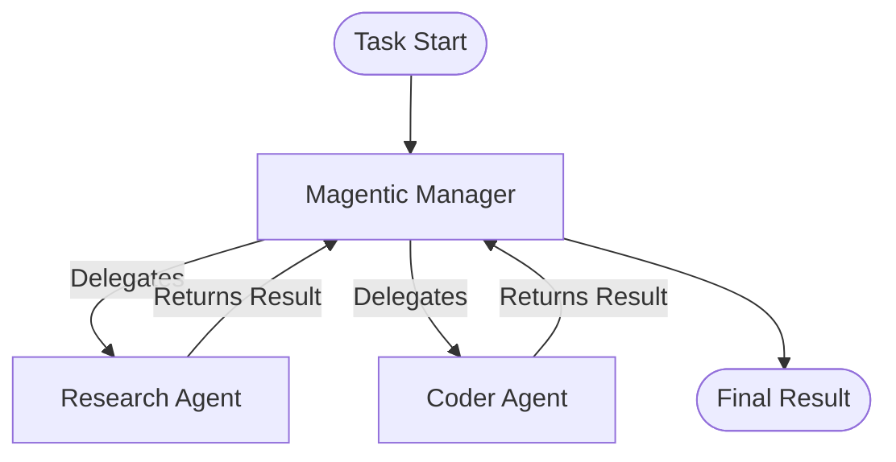

# Microsoft Agent Framework - Magentic Workflow

Консольное приложение для работы с Microsoft Agent Framework и различными типами Workflow Orchestration на C# .NET 8.0.

> 🎯 **Поддерживается 4 типа оркестрации:** Sequential, Concurrent, Conditional, Magentic

## 🌟 Что это?

Универсальная платформа для создания и выполнения AI-агентов workflows с динамической конфигурацией через JSON. Поддерживает все паттерны оркестрации из Microsoft Agent Framework.

### 🚀 Быстрый старт (1 минута)

```bash
# 1. Установка
./setup.sh  # или setup.bat на Windows

# 2. Запуск простого примера (работает без API ключей в DEMO режиме)
dotnet run workflow-simple.json

# 3. Настройте API ключ для реальной работы
# Отредактируйте appsettings.json
```

## 🎯 Особенности

- ✅ Загрузка логики workflow из JSON файлов
- ✅ Универсальный метод для любой конфигурации workflow
- ✅ Поддержка 4 типов оркестрации:
  - **Magentic** - динамическая координация агентов менеджером
  - **Sequential** - последовательное выполнение агентов (pipeline)
  - **Concurrent** - параллельное выполнение (fan-out/fan-in)
  - **Conditional** - условная маршрутизация на основе состояния
- ✅ Визуализация workflow перед запуском (Mermaid диаграммы)
- ✅ Вывод всех событий и сообщений в консоль
- ✅ Конфигурация агентов через JSON
- ✅ Гибкие настройки менеджера

## 📋 Требования

- .NET 8.0 SDK
- Visual Studio 2022 или VS Code
- OpenAI API ключ или Azure OpenAI endpoint

## 🚀 Установка

### 1. Клонирование и настройка

```bash
# Создайте директорию проекта
mkdir MagenticWorkflowApp
cd MagenticWorkflowApp

# Создайте структуру проекта
mkdir Models Services
```

### 2. Установка NuGet пакетов

```bash
dotnet restore
```

**ВАЖНО**: Пакеты `Microsoft.Agents.*` могут быть в preview версии. Проверьте актуальные версии:

```bash
# Поиск доступных версий
dotnet list package --outdated

# Установка preview пакетов (когда доступны)
dotnet add package Microsoft.Agents.AI --prerelease
dotnet add package Microsoft.Agents.AI.Workflows --prerelease
dotnet add package Microsoft.Agents.OpenAI --prerelease
```

### 3. Настройка API ключей

Отредактируйте `appsettings.json`:

```json
{
  "OpenAI": {
    "ApiKey": "ВАШ_OPENAI_API_KEY"
  }
}
```

Или используйте переменные окружения:

```bash
# Windows
set OpenAI__ApiKey=ваш_ключ

# Linux/Mac
export OpenAI__ApiKey=ваш_ключ
```

## 📁 Структура проекта

```
MagenticWorkflowApp/
├── Program.cs                          # Точка входа
├── MagenticWorkflowApp.csproj          # Файл проекта
├── appsettings.json                    # Конфигурация приложения
│
├── Workflow Examples/
│   ├── workflow-simple.json            # ⭐ Простой Magentic (начните здесь)
│   ├── workflow-sequential.json        # 📝 Sequential pipeline
│   ├── workflow-concurrent.json        # ⚡ Concurrent fan-out/fan-in
│   ├── workflow-conditional.json       # 🔀 Conditional routing
│   ├── workflow-config.json            # 🎯 Magentic ML analysis
│   └── workflow-advanced.json          # 🚀 Advanced multi-agent
│
├── Models/
│   └── WorkflowConfiguration.cs        # Модели данных + orchestration
│
├── Services/
│   ├── Interfaces.cs                   # Интерфейсы сервисов
│   ├── WorkflowJsonLoader.cs           # Загрузчик JSON
│   ├── WorkflowVisualizer.cs           # Визуализатор (Mermaid)
│   └── MagenticWorkflowOrchestrator.cs # Оркестратор (все типы)
│
├── Documentation/
│   ├── README.md                       # Основная документация
│   ├── USAGE-GUIDE.md                  # Подробное руководство
│   ├── WORKFLOW-SELECTION-GUIDE.md     # Выбор типа workflow
│   ├── EXAMPLES-OVERVIEW.md            # Обзор примеров
│   └── QUICK-REFERENCE.md              # Краткая справка
│
└── Scripts/
    ├── setup.sh                        # Установка (Linux/Mac)
    ├── setup.bat                       # Установка (Windows)
    └── run-examples.sh                 # Запуск всех примеров
```

## 🚀 Использование

### Базовый запуск

```bash
# Использование конфигурации по умолчанию (workflow-config.json)
dotnet run

# Использование конкретного файла конфигурации
dotnet run workflow-simple.json

# Разные типы workflow
dotnet run workflow-sequential.json     # Sequential pipeline
dotnet run workflow-concurrent.json     # Concurrent fan-out/fan-in
dotnet run workflow-conditional.json    # Conditional routing
```

## 🔀 Типы Workflow Orchestration

### 1. Sequential - Последовательный Pipeline

**Описание:** Агенты выполняются последовательно, один за другим. Выход одного агента является входом для следующего.

**Когда использовать:**
- Задачи требуют строгого порядка выполнения
- Каждый шаг зависит от результата предыдущего
- Нужен структурированный поток данных

**Пример конфигурации:**
```json
{
  "workflowType": "Sequential",
  "orchestration": {
    "startAgent": "DataCollectorAgent",
    "edges": [
      { "from": "DataCollectorAgent", "to": "AnalystAgent" },
      { "from": "AnalystAgent", "to": "ReportWriterAgent" }
    ]
  }
}
```

**Визуализация:**
```
Start → Agent1 → Agent2 → Agent3 → End
```

### 2. Concurrent - Параллельное выполнение

**Описание:** Все агенты выполняются одновременно с одинаковым входом. Результаты агрегируются.

**Когда использовать:**
- Задачи можно разделить на независимые подзадачи
- Нужна высокая пропускная способность
- Агенты имеют разные специализации для одной задачи

**Пример конфигурации:**
```json
{
  "workflowType": "Concurrent",
  "orchestration": {
    "concurrent": {
      "participantAgents": ["Agent1", "Agent2", "Agent3"],
      "aggregationStrategy": "Merge"
    }
  }
}
```

**Визуализация:**
```
        ┌─→ Agent1 ─┐
Start ──┼─→ Agent2 ─┼─→ Aggregate → End
        └─→ Agent3 ─┘
```

**Стратегии агрегации:**
- `Collect` - собрать все результаты в список
- `Merge` - объединить результаты в единый документ
- `Vote` - выбрать лучший результат голосованием

### 3. Conditional - Условная маршрутизация

**Описание:** Маршрутизация между агентами определяется условиями и состоянием выполнения.

**Когда использовать:**
- Путь выполнения зависит от промежуточных результатов
- Нужна динамическая логика принятия решений
- Разные сценарии требуют разных агентов

**Пример конфигурации:**
```json
{
  "workflowType": "Conditional",
  "orchestration": {
    "startAgent": "ClassifierAgent",
    "conditionalEdges": [
      {
        "from": "ClassifierAgent",
        "toOptions": ["TechnicalAgent", "BillingAgent", "GeneralAgent"],
        "selectionFunction": "classify_issue_type"
      }
    ]
  }
}
```

**Визуализация:**
```
Start → Classifier → Decision ┬─→ TechnicalAgent → End
                              ├─→ BillingAgent → End
                              └─→ GeneralAgent → End
```

### 4. Magentic - Динамическая координация

**Описание:** Менеджер динамически выбирает и координирует агентов на основе текущего контекста.

**Когда использовать:**
- Сложные задачи с неизвестным решением
- Требуется адаптивное планирование
- Нужно итеративное улучшение результатов

**Пример конфигурации:**
```json
{
  "workflowType": "Magentic",
  "manager": {
    "maxRoundCount": 10,
    "maxStallCount": 3
  },
  "agents": [...]
}
```

**Визуализация:**
```
                    ┌─→ Agent1 ─┐
Start → Manager ────┼─→ Agent2 ─┼──→ Manager → End
                    └─→ Agent3 ─┘
         ↑______________|
```

### Создание своей конфигурации

Создайте файл `my-workflow.json`:

```json
{
  "workflowType": "Magentic",
  "task": "Ваша задача здесь...",
  "manager": {
    "modelId": "gpt-4",
    "maxRoundCount": 10,
    "maxStallCount": 3,
    "maxResetCount": 2,
    "enablePlanReview": false
  },
  "agents": [
    {
      "name": "Agent1",
      "description": "Описание агента",
      "instructions": "Инструкции для агента",
      "modelId": "gpt-4",
      "tools": [],
      "metadata": {}
    }
  ],
  "settings": {}
}
```

Запустите:

```bash
dotnet run my-workflow.json
```

## 📊 Формат JSON конфигурации

### Корневые поля

| Поле | Тип | Описание |
|------|-----|----------|
| `workflowType` | string | Тип workflow: "Magentic", "Sequential", "Concurrent", "Conditional" |
| `task` | string | Описание задачи для выполнения |
| `manager` | object | Конфигурация менеджера (для Magentic) |
| `orchestration` | object | Конфигурация оркестрации (для Sequential/Concurrent/Conditional) |
| `agents` | array | Массив агентов |
| `settings` | object | Дополнительные настройки |

### Конфигурация Orchestration

#### Для Sequential:
```json
{
  "orchestration": {
    "startAgent": "FirstAgent",
    "edges": [
      { "from": "FirstAgent", "to": "SecondAgent", "label": "Optional Label" }
    ]
  }
}
```

#### Для Concurrent:
```json
{
  "orchestration": {
    "concurrent": {
      "participantAgents": ["Agent1", "Agent2", "Agent3"],
      "aggregationStrategy": "Merge"  // Collect, Merge, Vote
    }
  }
}
```

#### Для Conditional:
```json
{
  "orchestration": {
    "startAgent": "InitialAgent",
    "edges": [
      { "from": "Agent1", "to": "Agent2" }  // Static edges
    ],
    "conditionalEdges": [
      {
        "from": "DecisionAgent",
        "toOptions": ["OptionA", "OptionB", "OptionC"],
        "selectionFunction": "decision_logic_name",
        "parameters": {}
      }
    ]
  }
}
```

### Конфигурация Manager

| Поле | Тип | Описание |
|------|-----|----------|
| `modelId` | string | ID модели OpenAI (например, "gpt-4") |
| `maxRoundCount` | int | Максимальное количество раундов |
| `maxStallCount` | int | Максимальное количество раундов без прогресса |
| `maxResetCount` | int | Максимальное количество сбросов плана |
| `enablePlanReview` | bool | Включить ревью плана человеком |

### Конфигурация Agent

| Поле | Тип | Описание |
|------|-----|----------|
| `name` | string | Уникальное имя агента |
| `description` | string | Описание специализации |
| `instructions` | string | Инструкции для агента |
| `modelId` | string | ID модели для агента |
| `tools` | array | Список инструментов (например, ["CodeInterpreter"]) |
| `metadata` | object | Дополнительные метаданные |

## 🎨 Визуализация Workflow

Приложение автоматически создает визуализацию workflow перед запуском:

1. **Консольная визуализация** - структурированный вывод конфигурации
2. **Mermaid диаграмма** - граф взаимодействия агентов

Пример диаграммы:



## 📝 События и логирование

Приложение выводит следующие события:

- `[ORCHESTRATOR]` - события менеджера (планирование, координация)
- `[AGENT:name]` - события агентов (выполнение задач)
- `[STREAM:name]` - потоковый вывод токенов
- `[FINAL RESULT]` - итоговый результат

## 🔧 Расширенные возможности

### Human-in-the-Loop Plan Review

Включите в конфигурации:

```json
{
  "manager": {
    "enablePlanReview": true
  }
}
```

### Добавление инструментов агентам

```json
{
  "agents": [
    {
      "name": "CoderAgent",
      "tools": ["CodeInterpreter"],
      ...
    }
  ]
}
```

## 🐛 Отладка

Включите детальное логирование в `appsettings.json`:

```json
{
  "Logging": {
    "LogLevel": {
      "Default": "Debug"
    }
  }
}
```

## 📚 Примеры задач

### Пример 1: Sequential - Анализ исследований
```bash
dotnet run workflow-sequential.json
```
**Задача:** Создание исследовательского отчета о квантовых вычислениях в криптографии.
**Flow:** Сбор данных → Анализ → Оценка безопасности → Написание отчета

### Пример 2: Concurrent - Анализ индустрий
```bash
dotnet run workflow-concurrent.json
```
**Задача:** Параллельный анализ влияния AI на разные индустрии.
**Flow:** Одновременный анализ Healthcare, Finance, Education, Transportation → Агрегация

### Пример 3: Conditional - Обработка тикетов
```bash
dotnet run workflow-conditional.json
```
**Задача:** Умная маршрутизация обращений поддержки.
**Flow:** Анализ → Классификация → Динамическая маршрутизация (Technical/Billing/General) → Ответ

### Пример 4: Magentic - Энергоэффективность ML
```bash
dotnet run workflow-config.json
```
**Задача:** Сравнение энергопотребления разных ML моделей.
**Flow:** Менеджер динамически координирует Researcher и Coder агентов

## ⚠️ Важные замечания

1. **API ключи**: Не коммитьте `appsettings.json` с реальными ключами в Git
2. **Costs**: OpenAI API платный - следите за использованием
3. **Preview пакеты**: Microsoft.Agents.* могут быть нестабильными
4. **Rate limits**: Соблюдайте лимиты API OpenAI

## 🔐 Безопасность

```bash
# Используйте .NET User Secrets для хранения ключей
dotnet user-secrets init
dotnet user-secrets set "OpenAI:ApiKey" "ваш_ключ"
```

## 🤝 Вклад

Вопросы и предложения приветствуются!

## 📄 Лицензия

MIT License

## 🔗 Полезные ссылки

- [Microsoft Agent Framework Documentation](https://learn.microsoft.com/en-us/agent-framework/)
- [Magentic Orchestration Guide](https://learn.microsoft.com/en-us/agent-framework/user-guide/workflows/orchestrations/magentic)
- [OpenAI API Documentation](https://platform.openai.com/docs)
